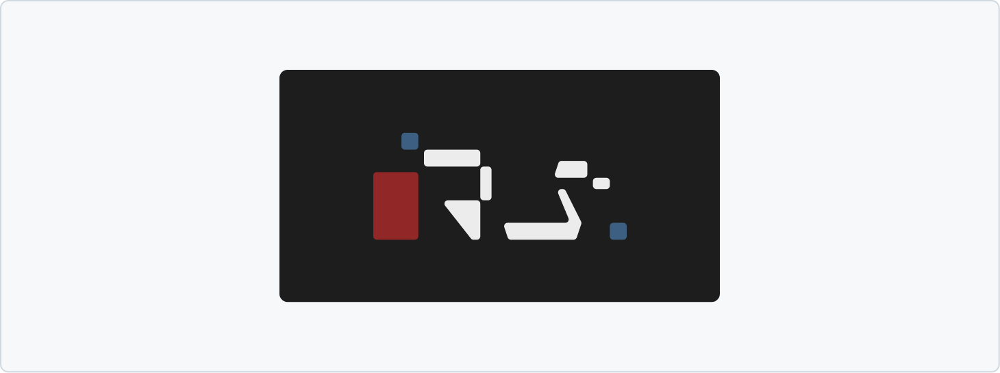

<picture>
  <source media="(prefers-color-scheme: dark)" srcset="./repo-assets/logo_dark.png">
  
</picture>

 

My personal website, built with Angular. It consist of a single-page static site with two routes.
 
Despite already being familiar with Angular, I still tried to challenge myself by not using any external library whatsover, just vanilla Angular and TypeScript. I also tried to keep the components modifiable and extensible so they can be easily updated with more content in the future.

Source code is located in the [`/homepage`](https://github.com/ricardosantosfc/personal-website/tree/main/homepage) directory. It still needs some refactoring and cleanup, so proceed with caution! 

## Installing, running and building

Refer to the README in [`/homepage`](https://github.com/ricardosantosfc/personal-website/tree/main/homepage#homepage).

## Tools, platforms, credits and mentions

- [Figma](https://www.figma.com/) was used for moodboarding and designing the logo, minigame characters, "what" project images, site layout, and some icons.
  
- As I was struggling a bit initially trying to figure out how to make the minigame using just vanilla TypeScript, I made a quick standalone prototype with [Unity v2023.1.12f1](https://unity.com). It turned out to be a good call, as it helped me lay down the core gameplay mechanics and basic object structure using a workflow I'm quite comfortable with.
  
- Both "my avatar" and the background for the minigame were modeled, textured, animated and rendered with [Blender v3.2](https://www.blender.org/). Rock textures from [Poly Haven](https://polyhaven.com/a/aerial_rocks_04). Sky HDRI also from a free resource library i've unfortunately lost track of. Avatar face texture from IRL me (technically sourced from my parents, thanks mom, thanks dad)
  
- [Krita v5.2.11](https://krita.org/pt-pt/download/) was used for color grading, generating the avatar sprites' outlines, and layering the back facing avatar sprite on the room background.
  
- Currently deployed on [Render](https://render.com/) and [Netlify](https://www.netlify.com/) (the domain points to the one I’ve got more budget for at the moment).
  
- [RealFaviconGenerator](https://realfavicongenerator.net/) helped me quickly set up and generate favicons.
  
- [Coolors](https://coolors.co/) was used for palette prototyping and contrast checking.
  
- [Presize.io](https://www.presize.io/) was used for batch cropping and resizing the avatar sprites.
  
- [CodeAndWeb's spritesheet packer](https://www.codeandweb.com/free-sprite-sheet-packer) for packing the avatar sprites into a spritesheet.
  
- [Pixel Art Village](https://pixelartvillage.com/) for quickly pixelizing minigame and avatar backgrounds.
  
- [TinyPNG](https://tinypng.com/) for compressing assets.
  
- Additional fonts from [Google Fonts](https://fonts.google.com/share?selection.family=Anta|Montserrat:ital,wght@0,100..900;1,100..900|VT323).
  
- Additional icons from [Bootstrap Icons](https://icons.getbootstrap.com/).
  
- Personal website inspiration from [Guillaume Gouessan](https://guillaumegouessan.com/), [David Heckoff](https://david-hckh.com/), [Henry Heffernan](https://henryheffernan.com/), [Bryant Smith](https://bryantcodes.art/), and [Jesse Zhou](https://www.jesse-zhou.com/), to name a few.

## Additional considerations, trivia, misc... (just me babbling, you don't actually have to read all this!)

- I originally planned to make a fully 3D-based website using React and Three.js, but ultimately realized it would take me a while to come up with something that I'd be happy with as I'm still quite inexperienced at both.
  
- I don't know if it's just because of infinite scroll fatigue or something, but non-scrollable websites have become really appealing to me these past couple years. I thus tried to keep the website non-scrollable whenever possible, even on mobile devices, while also still retaining the default HTML margins. Making sure the content didn't overflow was challenging for some devices; I ended up logging the dimensions of some elements over and over just to figure out what was causing overflow - for example, for the "what" route project "cards", the font not loading immediately during initialization sometimes threw div dimensions off.
  
- I made sure the main contents of the website are tabbable, but tabbing through the "who" route can feel a bit awkward when choice buttons disappear and the canvas becomes interactable again - you have to tab through the footer and navbar to get focus back on the canvas. I definitely still need to put a bit more work into optimizing the site for screen-readers.
  
- I spent quite a bit of time coming up with a logo design I was happy with; I wanted it to appear both retro and futuristic at the same time. Figuring how to sneak in an easter egg without it feeling too out of place also took me a few hours haha. References for the logo included Car Bomb s' Meta album artwork, Millimetric Instruments guitars, Mirror's Edge and Gundam artwork, and Lissitzky paintings.
  
- I've also put a lot of thought into designing a dark theme that is (imo) pleasant to look at: trying to avoid halation by not using pure white on pure black, balancing contrasts, using faded colors instead of highly saturated ones, and so on. I had initially planned for it to be dark-mode only, but after reading users' feedback on other dark-mode-only apps, I decided to add a light mode as well. I probably should've set the theme to automatically sync with users' system preferences, but I honestly think the dark theme just looks a bit nicer so I kept it as the default, sorry hehehe.
  
- Since this is probably a one-time-visit kinda website, I made the conscious decisions not to persist users' current theme or minigame max score.
  
- The "who" canvas is obviously inspired by rpg games and visual novels. I thought this would be a more creative and playful way to include an “About Me” section without it feeling like one hahaha.
  
- Making the "what" project screenshots transition between each other ended up being a daunting task! As I decided to have different behaviors for hoverable (with images transitioning only when the parent wrapper is hovered) and non-hoverable devices (with images transitioning automatically), I had to figure out how to coordinate the images loading with opacity transitions and parent wrapper animations. It was quite buggy for a while; sometimes the projects would switch out before the "new" project images were fully loaded, causing a very awkward aria-label pop in, for example. I still feel there's room for improvement, and in hindsight I probably should've just focused on implementing the non-hoverable behavior across all devices.
  
- Yes, I used ChatGPT as an over-glorified stackoverflow, and its suggestions were implemented here and there, namely in canvas scaling logic, drawing icons "inline" with text on canvas, and some CSS tricks and tweaks. No AI was used for generating graphic assets.
